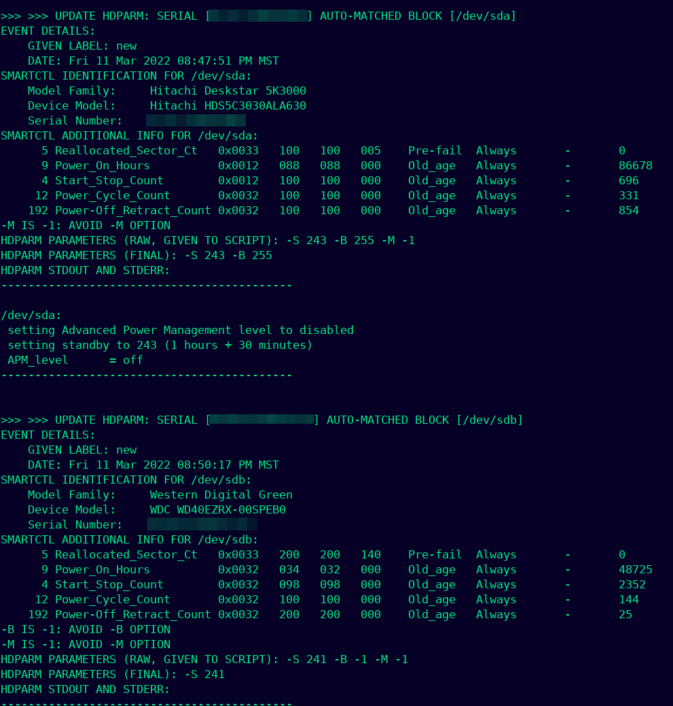

# Everest: a wrapper for hdparm and smartctl

# What is the Program?
Everest is a wrapper of `hdparm` and `smartctl` that focuses on adjusting the Automatic Acoustic Management (AAM), Standby Timeout, and the Advanced Power Management (APM) parameters of hard drives.
The utility `hdparm` actually modifies the settings of hard drives, while `smartctl` is used for merely gathering the SMART information of the hard drives (without actually running SMART tests).

Some of Everest's main features include:

* A modular design that maximizes utility and minimizes stress for the user.
    * The main script `core.sh` performs all of the work in executing hdparm and smartctl and saving their output and other important information into a log file.
    * All the user has to do is call `core.sh` either in the shell, in another script, or in a cronjob.
* A highly readible log file.
    * Captures the STDOUT and STDERR from hdparm, aiding in troubleshooting and debugging hdparm options after running.
* References hard drives by their serial numbers, NOT by their Linux block devices.
    * Normally block devices for hard drives (e.g. `/dev/sdX`) are NOT permamently assigned; they change as devices are plugged in and unplugged.
    * Thus, one of the least ambiguous ways to reference a hard drive is to use its serial number.

# Motivation for the Program
On March 11, 2022, I officially began the project as a means to solve a troublesome issue I had with hdparm and my file server. When running hdparm in my shell to change the power management behavior of my hard drives, the changes would either not persist after a reboot or have any immediate effect whatsoever. This occured across multiple hard drives with different brands, models, and specs. I wrote this system to closely log and monitor the hard drives after running hdparm commands to further explore the issue.

# Contents of this Repository
* `core.sh`
* `preface.sh`
* template for "execute all"
* template for "external script"

# Usage and Implementation:

## Simplest Usage
To immediately use the system and call hdparm to tweak your hard drives, simply run `core.sh` with these parameters:

* **1st parameter**: `label`        (required) A small memo or message to distinguish this invocation of core.sh from other invocations in the logs.
* **2nd parameter**: `serial`         (required) The serial number of the hard drive.
* **3rd parameter**: `optionS`      (required) Sets the Standby Timeout value in HDPARM (same as -S option), this cannot be ignored with `-1`.
* **4th parameter**: `optionB`      (required) Sets the APM value in HDPARM, use `-1` to skip this parameter and do nothing in terms of APM.
* **5th parameter**: `optionM`      (required) sets the AAM value in HDPARM, use `-1` to skip this parameter and do nothing in terms of AAM.

## Long-Term Implementation

### Running core.sh in another script file
Running `core.sh` from another "external" script file is recommended if you are expecting to execute core.sh with specific parameters many times in the present and future. This is also ideal for crontab or automated execution. **A template script for running core.sh is provided in the repository as ** `template-external_script.sh`.

### Writing an "execute all" script file
If you would like to use this system with multiple hard drives, it is recommended to have a script that executes multiple external scripts or calls `core.sh` multiple times. Although this may seem like an extremely obvious approach, there is a specific, recommended approach to this: call `preface.sh` at the beginning of your script to append a special header to the log file explaining that multiple `core.sh` calls will be made (results in a more readible log file). **A template script for executing** `core.sh` **multiple times is provided in the repository as ** `template-external_script.sh`.